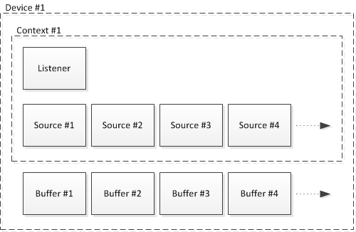
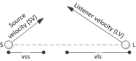

# OpenAL Programmer's Guide - Versions 1.0 and 1.1

## Table of Contents
* [About this Document](#about-this-document)
  + [Introduction](#introduction)
  + [Intended Audience](#intended-audience)
  + [Other OpenAL Resources](#other-openal-resources)
* [Introduction to OpenAL](#introduction-to-openal)
  + [Objects](#objects)
  + [Device Enumeration](#device-enumeration)
  + [Initializing/Exiting](#initializing-exiting)
  + [Listener properties](#listener-properties)
  + [Buffer Properties](#buffer-properties)
  + [Source Properties](#source-properties)
  + [Queuing Buffers on a Source](#queuing-buffers-on-a-source)
  + [Doppler Shift](#doppler-shift)
  + [Error Handling](#error-handling)
  + [Extensions](#extensions)
* [Buffer Functions](buffer.md#buffer-functions)
  + [Properties](buffer.md#properties)
  + [Functions](buffer.md#functions)
* [Source Functions](source.md#source-functions)
  + [Properties](source.md#properties)
  + [Functions](source.md#functions)
* [Listener Functions](listener.md#listener-functions)
  + [Properties](listener.md#properties)
  + [Functions](listener.md#functions)
* [State Functions](state.md#state-functions)
  + [Properties](state.md#properties)
  + [Functions](state.md#functions)
* [Error Functions](error.md#error-functions)
  + [Error Codes](error.md#error-codes)
  + [Functions](error.md#functions)
* [Extension Functions](extension.md#extension-functions)
  + [Functions](extension.md#functions)
* [Context Management Functions](context-management.md#context-management-functions)
  + [Properties](context-management.md#properties)
  + [Functions](context-management.md#functions)
* [Context Error Functions](context-error.md#context-error-functions)
  + [Error Codes](context-error.md#error-codes)
  + [Functions](context-error.md#functions)
* [Context Device Functions](context-device.md#context-device-functions)
  + [Functions](context-device.md#functions)
* [Context Extension Functions](context-extension.md#context-extension-functions)
  + [Functions](context-extension.md#functions)
* [Context State Functions](context-state.md#context-state-functions)
  + [Functions](context-state.md#functions)
* [Context Capture Functions](context-capture.md#context-capture-functions)
  + [Functions](context-capture.md#functions)
* [Standard Extensions to OpenAL](extensions/)
  + [Enumeration Extension](extensions/enumeration.md)

## About this Document
### Introduction
OpenAL is a cross-platform three-dimensional audio API. The API’s primary
purpose is to allow an application to position audio sources in a
three-dimensional space around a listener, producing reasonable spatialization
of the sources for the audio system (headphones, 2.1 speaker output, 5.1 speaker
output, etc.) Through extensions, Creative Labs has also enhanced OpenAL with
EAX and other capabilities. OpenAL is appropriate for many audio applications,
but was designed to be most appropriate for gaming audio.

### Intended Audience
This reference guide is most appropriate for a programmer. Experience with C or
C++ is not required to learn the concepts in OpenAL, but will make understanding
the OpenAL source as well as sample code easier. Since there are several sample
applications included with the OpenAL SDKs as well as with the source
distribution, it is recommended that interested programmers take advantage of
those resources.

### Other OpenAL Resources
The two most important resources for additional information on OpenAL are the
websites at www.openal.org and http://developer.creative.com. The main OpenAL
site hosts the specification, the open source implementations, and sample code.
The Creative developer site has a section dedicated to OpenAL with SDKs showing
how to use OpenAL as well as various extensions.

## Introduction to OpenAL
Use of OpenAL revolves around the use of three fundamental objects – Buffers,
Sources, and a Listener. A buffer can be filled with audio data, and can then be
attached to a source. The source can then be positioned and played. How the
source is heard is determined by its position and orientation relative to the
Listener object (there is only one Listener). Creating a number of sources and
buffers and a single listener and then updating the positions and orientations
of the sources and listener dynamically can present a convincing 3D audio world.

### Objects
Here is a diagram showing the fundamental OpenAL objects and their relationships
to the context and device objects:



When initializing OpenAL, at least one device has to be opened.  Within that
device, at least one context will be created.  Within that context, one listener
object is implied, and a multitude of source objects can be created.  Each
source can have one or more buffers objects attached to it. Buffer objects are
not part of a specific context – they are shared among all contexts on one
device.

### Device Enumeration
The function call to open a device, [alcOpenDevice](context-device.md#alcopendevice), takes a
string as input.  The string should contain either the name of a valid OpenAL
rendering device, or `NULL` to request the default device.

On PC Systems, a number of different OpenAL renderering devices may co-exist.
For example a “native” renderer specific to the user’s high-end soundcard, and a
host-based software fallback renderer.  On platforms where multiple renderers
can be present, an OpenAL application may require the ability to identify the
different devices available, in order to give the end-user a choice of device.
OpenAL’s [Enumeration extension](extensions/enumeration.md) makes this possible.

The Enumeration extension allows the programmer to retrieve a string listing the
names of available devices.  It can also provide the name of the default device.
Use [alcGetString](context-state.md#alcgetstring) with the device property set
to `NULL`, and the enum property set to `ALC_DEVICE_SPECIFIER` to get the list
of available devices.  To get the default device name, pass in `NULL` and
`ALC_DEFAULT_DEVICE_SPECIFIER`.

The Enumeration extension also works with capture devices – the equivalent
values are `ALC_CAPTURE_DEVICE_SPECIFIER` and
`ALC_CAPTURE_DEFAULT_DEVICE_SPECIFIER`.

The programmer can find out more about the capabilities of each device by
querying to see which extensions it supports using
[alcIsExtensionPresent](context-extension.md#alcisextensionpresent) and
[alIsExtensionPresent](extension.md#alIsextensionpresent).

### Initializing/Exiting
As described above, the first step to initializing OpenAL is to open a device.
Once that is successfully done, then a context is opened on that device.  Now
the fundamental OpenAL objects can be managed – the listener, various sources,
and various buffers.

To generate a set of buffers for use, use [alGetError](error.md#algeterror) to
reset the error state, call [alGenBuffers](buffer.md#algenbuffers) to generate
the number of buffers desired, and then use [alGetError](error.md#algeterror)
again to detect if an error was generated.

Fill the buffers with PCM data using [alBufferData](buffer.md#albufferdata).

To generate a set of sources for use, use [alGetError](error.md#algeterror) to
reset the error state, call [alGenSources](source.md#algensources) to generate
the number of sources desired, and then use [alGetError](error.md#algeterror)
again to detect if an error was generated.

Buffers are attached to sources using [alSourcei](source.md#alsourcei).

Once a buffer has been attached to a source, the source can play the buffer
using [alSourcePlay](source.md#alsourceplay).

Source and Listener properties can be updated dynamically using property set and
get calls such as [alGetListenerfv](listener.md#algetlistenerfv),
[alListener3f](listener.md#allistener3f), [alSourcei](source.md#alsourcei), and
[alGetSource3f](source.md#algetsource3f).

Example:

```cpp
// Initialization
Device = alcOpenDevice(NULL); // select the "preferred device"

if (Device) {
    Context=alcCreateContext(Device,NULL);
    alcMakeContextCurrent(Context);
}

// Check for EAX 2.0 support
g_bEAX = alIsExtensionPresent("EAX2.0");

// Generate Buffers
alGetError(); // clear error code

alGenBuffers(NUM_BUFFERS, g_Buffers);
if ((error = alGetError()) != AL_NO_ERROR)
{
    DisplayALError("alGenBuffers :", error);
    return;
}

/ Load test.wav
loadWAVFile("test.wav",&format,&data,&size,&freq,&loop);
if ((error = alGetError()) != AL_NO_ERROR)
{
    DisplayALError("alutLoadWAVFile test.wav : ", error);
    alDeleteBuffers(NUM_BUFFERS, g_Buffers);
    return;
}

// Copy test.wav data into AL Buffer 0
alBufferData(g_Buffers[0],format,data,size,freq);
if ((error = alGetError()) != AL_NO_ERROR)
{
    DisplayALError("alBufferData buffer 0 : ", error);
    alDeleteBuffers(NUM_BUFFERS, g_Buffers);
    return;
}

// Unload test.wav
unloadWAV(format,data,size,freq);
if ((error = alGetError()) != AL_NO_ERROR)
{
    DisplayALError("alutUnloadWAV : ", error);
    alDeleteBuffers(NUM_BUFFERS, g_Buffers);
    return;
}

// Generate Sources
alGenSources(1,source);
if ((error = alGetError()) != AL_NO_ERROR)
{
    DisplayALError("alGenSources 1 : ", error);
    return;
}

// Attach buffer 0 to source
alSourcei(source[0], AL_BUFFER, g_Buffers[0]);
if ((error = alGetError()) != AL_NO_ERROR)
{
    DisplayALError("alSourcei AL_BUFFER 0 : ", error);
}

// Exit
Context=alcGetCurrentContext();
Device=alcGetContextsDevice(Context);
alcMakeContextCurrent(NULL);
alcDestroyContext(Context);
alcCloseDevice(Device);
```

### Listener properties
For every context, there is automatically one Listener object.  The
`alListener[f, 3f, fv, i]` and `alGetListener[f, 3f, fv, i]` families of
functions can be used to set or retrieve the following listener properties:

| Property         | Data Type              | Description                                    |
| ---------------- | ---------------------- | ---------------------------------------------- |
| `AL_GAIN`        | `f`, `fv`              | Master gain. Value should be positive          |
| `AL_POSITION`    | `fv`, `3f`, `iv`, `3i` | X, Y, Z position                               |
| `AL_VELOCITY`    | `fv`, `3f`, `iv`, `3i` | Velocity vector                                |
| `AL_ORIENTATION` | `fv`, `iv`             | Orientation expressed as “at” and “up” vectors |

Example:

```cpp
ALfloat listenerPos[]={0.0,0.0,0.0};
ALfloat listenerVel[]={0.0,0.0,0.0};
ALfloat listenerOri[]={0.0,0.0,-1.0, 0.0,1.0,0.0};

// Position ...
alListenerfv(AL_POSITION,listenerPos);
if ((error = alGetError()) != AL_NO_ERROR)
{
    DisplayALError("alListenerfv POSITION : ", error);
    return;
}

// Velocity ...
alListenerfv(AL_VELOCITY,listenerVel);
if ((error = alGetError()) != AL_NO_ERROR)
{
    DisplayALError("alListenerfv VELOCITY : ", error);
    return;
}

// Orientation ...
alListenerfv(AL_ORIENTATION,listenerOri);
if ((error = alGetError()) != AL_NO_ERROR)
{
    DisplayALError("alListenerfv ORIENTATION : ", error);
    return;
}
```

### Buffer Properties
Each buffer generated by [alGenBuffers](buffer.md#algenbuffers) has properties which can
be retrieved.  The `alGetBuffer[f, i]` functions can be used to retrieve the
following buffer properties:

| Property       | Data Type | Description |
| -------------- | --------- | ----------- |
| `AL_FREQUENCY` | `i`, `iv` | Frequency of buffer in Hz |
| `AL_BITS`      | `i`, `iv` | Bit depth of buffer |
| `AL_CHANNELS`  | `i`, `iv` | Number of channels in buffer. > 1 is valid, but buffer won’t be positioned when played |
| `AL_SIZE`      | `i`, `iv` | Size of buffer in bytes |
| `AL_DATA`      | `i`, `iv` | Original location where data was copied from generally useless, as was probably freed after buffer creation |

Example:

```cpp
// Retrieve Buffer Frequency
alBufferi(g_Buffers[0], AL_FREQUENCY, iFreq);
```

### Source Properties
Each source generated by [alGenSources](source.md#algensources) has properties which can
be set or retrieved.  The `alSource[f, 3f, fv, i]` and
`alGetSource[f, 3f, fv, i]` families of functions can be used to set or retrieve
the following source properties:

| Property                | Data Type              | Description |
| ----------------------- | ---------------------- | ----------- |
| `AL_PITCH`              | `f`, `fv`              | Pitch multiplier. Always positive |
| `AL_GAIN`               | `f`, `fv`              | Source gain. Value should be positive |
| `AL_MAX_DISTANCE`       | `f`, `fv`, `i`, `iv`   | Used with the Inverse Clamped Distance Model to set the distance where there will no longer be any attenuation of the source |
| `AL_ROLLOFF_FACTOR`     | `f`, `fv`, `i`, `iv`   | The rolloff rate for the source. Default is 1.0 |
| `AL_REFERENCE_DISTANCE` | `f`, `fv`, `i`, `iv`   | The distance under which the volume for the source would normally drop by half (before being influenced by rolloff factor or `AL_MAX_DISTANCE`) |
| `AL_MIN_GAIN`           | `f`, `fv`              | The minimum gain for this source |
| `AL_MAX_GAIN`           | `f`, `fv`              | The maximum gain for this source |
| `AL_CONE_OUTER_GAIN`    | `f`, `fv`              | The gain when outside the oriented cone |
| `AL_CONE_INNER_ANGLE`   | `f`, `fv`, `i`, `iv`   | The gain when inside the oriented cone |
| `AL_CONE_OUTER_ANGLE`   | `f`, `fv`, `i`, `iv`   | Outer angle of the sound cone, in degrees. Default is 360 |
| `AL_POSITION`           | `fv`, `3f`             | X, Y, Z position |
| `AL_VELOCITY`           | `fv`, `3f`             | Velocity vector |
| `AL_DIRECTION`          | `fv`, `3f`, `iv`, `3i` | Direction vector |
| `AL_SOURCE_RELATIVE`    | `i`, `iv`              | Determines if the positions are relative to the listener. Default is `AL_FALSE` |
| `AL_SOURCE_TYPE`        | `i`, `iv`              | The source type – `AL_UNDETERMINED`, `AL_STATIC`, or `AL_STREAMING` |
| `AL_LOOPING`            | `i`, `iv`              | Turns looping on (`AL_TRUE`) or off (`AL_FALSE`) |
| `AL_BUFFER`             | `i`, `iv`              | The ID of the attached buffer |
| `AL_SOURCE_STATE`       | `i`, `iv`              | The state of the source (`AL_STOPPED`, `AL_PLAYING`, …) |
| `AL_BUFFERS_QUEUED`*    | `i`, `iv`              | The number of buffers queued on this source |
| `AL_BUFFERS_PROCESSED`  | `i`, `iv`              | The number of buffers in the queue that have been processed |
| `AL_SEC_OFFSET`         | `f`, `fv`, `i`, `iv`   | The playback position, expressed in seconds |
| `AL_SAMPLE_OFFSET`      | `f`, `fv`, `i`, `iv`   | The playback position, expressed in samples |
| `AL_BYTE_OFFSET`        | `f`, `fv`, `i`, `iv`   | The playback position, expressed in bytes |

*\* Read Only (alGetSourcei)*

Example:

```cpp
alGetError(); // clear error state
alSourcef(source[0],AL_PITCH,1.0f);
if ((error = alGetError()) != AL_NO_ERROR)
    DisplayALError("alSourcef 0 AL_PITCH : \n", error);

alGetError(); // clear error state
alSourcef(source[0],AL_GAIN,1.0f);
if ((error = alGetError()) != AL_NO_ERROR)
    DisplayALError("alSourcef 0 AL_GAIN : \n", error);

alGetError(); // clear error state
alSourcefv(source[0],AL_POSITION,source0Pos);
if ((error = alGetError()) != AL_NO_ERROR)
    DisplayALError("alSourcefv 0 AL_POSITION : \n", error);

 alGetError(); // clear error state
alSourcefv(source[0],AL_VELOCITY,source0Vel);
if ((error = alGetError()) != AL_NO_ERROR)
    DisplayALError("alSourcefv 0 AL_VELOCITY : \n", error);

alGetError(); // clear error state
alSourcei(source[0],AL_LOOPING,AL_FALSE);
if ((error = alGetError()) != AL_NO_ERROR)
    DisplayALError("alSourcei 0 AL_LOOPING true: \n", error);
```

### Queuing Buffers on a Source
To continuously stream audio from a source without interruption, buffer queuing
is required.  To use buffer queuing, the buffers and sources are generated in
the normal way, but [alSourcei](source.md#alsourcei) is not used to attach the
buffers to the source.  Instead, the functions
[alSourceQueueBuffers](source.md#alsourcequeuebuffers) and
[alSourceUnqueueBuffers](source.md#alsourceunqueuebuffers) are used.  The
program can attach a buffer or a set of buffers to a source using
[alSourceQueueBuffers](source.md#alsourcequeuebuffers), and then call
[alSourcePlay](source.md#alsourceplay) on that source.  While the source is
playing, [alSourceUnqueueBuffers](source.md#alsourceunqueuebuffers) can be
called to remove buffers which have already played.  Those buffers can then be
filled with new data or discarded.  New or refilled buffers can then be attached
to the playing source using
[alSourceQueueBuffers](source.md#alsourcequeuebuffers).  As long as there is
always a new buffer to play in the queue, the source will continue to play.

Although some 1.0 implementations of OpenAL may not enforce the following
restrictions on queuing, it is recommended to observe the following additional
rules, which do universally apply to 1.1 implementations:

1)  A source that will be used for streaming should not have its first buffer
attached using [alSourcei](source.md#alsourcei) – always use
[alSourceQueueBuffers](source.md#alsourcequeuebuffers) to attach buffers to
streaming sources.  Any source can have all buffers detached from it using
`alSourcei(..., AL_BUFFER, 0)`, and can then be used for either streaming or
non-streaming buffers depending on how data is then attached to the source (with
[alSourcei](source.md#alsourcei) or with
[alSourceQueueBuffers](source.md#alsourcequeuebuffers)).

2)  All buffers attached to a source using
[alSourceQueueBuffers](source.md#alsourcequeuebuffers) should have the same
audio format.

### Doppler Shift
The Doppler effect depends on the velocities of source and listener relative to
the medium, and the propagation speed of sound in that medium. The application
might want to emphasize or deemphasize the Doppler effect as physically accurate
calculation might not give the desired results. The amount of frequency shift
(pitch change) is proportional to the speed of listener and source along their
line of sight.

The Doppler effect as implemented by OpenAL is described by the formula below.
Effects of the medium (air, water) moving with respect to listener and source
are ignored.

* SS: `AL_SPEED_OF_SOUND` = speed of sound (default value 343.3)
* DF: `AL_DOPPLER_FACTOR` = Doppler factor (default 1.0)
* vls: Listener velocity scalar (scalar, projected on source-to-listener vector)
* vss: Source velocity scalar (scalar, projected on source-to-listener vector)
* f: Frequency of sample
* f': Effective Doppler shifted frequency
* SL: Source tt listener vector
* SV: Source velocity vector
* LV: Listener velocity vector

Graphic representation of vls and vss:


3D Mathematical representation of vls and vss:


)

)


There are two API calls global to the current context that provide control of
the speed of sound and Doppler factor. `AL_DOPPLER_FACTOR` is a simple scaling
of source and listener velocities to exaggerate or deemphasize the Doppler
(pitch) shift resulting from the calculation.

```cpp
void alDopplerFactor(ALfloat dopplerFactor);
```

A negative value will result in an `AL_INVALID_VALUE` error, the command is then
ignored. The default value is 1. The current setting can be queried using
`alGetFloat{v}` and `AL_DOPPLER_FACTOR`.

`AL_SPEED_OF_SOUND` allows the application to change the reference (propagation)
speed used in the Doppler calculation.  The source and listener velocities
should be expressed in the same units as the speed of sound.

```cpp
void alSpeedOfSound(ALfloat speed);
```

A negative or zero value will result in an `AL_INVALID_VALUE` error, and the
command is ignored. The default value is 343.3 (appropriate for velocity units
of meters and air as the propagation medium). The current setting can be queried
using `alGetFloat{v}` and `AL_SPEED_OF_SOUND`.

Distance and velocity units are completely independent of one another (so you
could use different units for each if desired).  If an OpenAL application
doesn't want to use Doppler effects, then leaving all velocities at zero will
achieve that result.

### Error Handling
The error state of OpenAL can be retrieved at any time using
[alGetError](error.md#algeterror).  [alGetError](error.md#algeterror) clears the
error state of OpenAL when it is called, so it is common for an OpenAL
application to call [alGetError](error.md#algeterror) at the beginning of a
critical operation to clear the error state, perform the critical operation, and
then use [alGetError](error.md#algeterror) again to test whether or not an error
occurred.

Error Codes:

| Error Code           | Description |
| -------------------- | ----------- |
| AL_NO_ERROR          | there is not currently an error |
| AL_INVALID_NAME      | a bad name (ID) was passed to an OpenAL function |
| AL_INVALID_ENUM      | an invalid enum value was passed to an OpenAL function |
| AL_INVALID_VALUE     | an invalid value was passed to an OpenAL function |
| AL_INVALID_OPERATION | the requested operation is not valid |
| AL_OUT_OF_MEMORY     | the requested operation resulted in OpenAL running out of memory |

Example:

```cpp
alGetError();  // Clear Error Code

// Generate Buffers
alGenBuffers(NUM_BUFFERS, g_Buffers);
if ((error = alGetError()) != AL_NO_ERROR)
{
    DisplayALError("alGenBuffers :", error);
    exit(-1);
}
```

### Extensions
OpenAL has an extension mechanism that can be used by OpenAL vendors to add new
features to the API.  Creative Labs have added a number of extensions including
EAX, X-RAM, Multi Channel Buffer playback, and most recently an Effect Extension
(EFX).  To determine if an extension is available the application can use either
[alIsExtensionPresent](extension.md#alisextensionpresent) or
[alcIsExtensionPresent](context-extension.md#alcisextensionpresent) depending on
the type of extension.  The Appendices contain more details about some of
Creative’s extensions to OpenAL.
